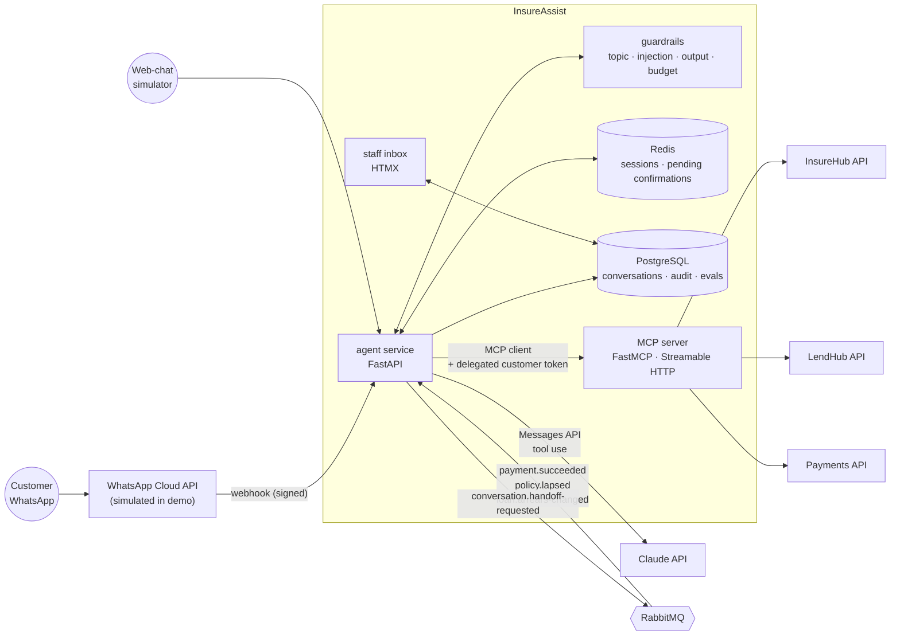
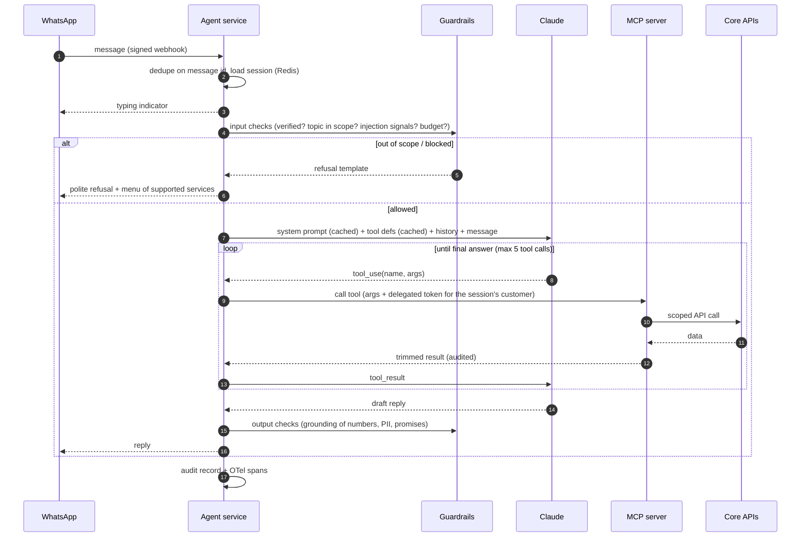

# InsureAssist — architecture

## 1. Containers (C4 level 2)



Why a separate MCP server rather than functions inside the agent (ADR-0002): the tool layer becomes a reusable, independently secured and audited product. The same tools can serve a staff copilot, another model or another channel, and it is the integration standard employers are adopting.

## 2. The agent loop (one customer turn)



The loop follows Anthropic's guidance for agents: keep it simple, make tools clear and hard to misuse, keep humans in control of consequential actions ([Building effective agents](https://www.anthropic.com/engineering/building-effective-agents)).

**Models:** a capable model for the main loop (e.g. `claude-sonnet-5-5`), a small fast model (e.g. `claude-haiku-4-5`) for topic classification and summaries; both configurable. Prompt caching is on for the system prompt and tool definitions.

## 3. MCP tool catalogue

All tools are customer-scoped. **None take a customer identifier as an argument**: the MCP server reads the customer from the delegated token (ADR-0003).

| Tool | Kind | Backend | Returns (trimmed) |
|---|---|---|---|
| `list_my_policies()` | read | InsureHub | number, line, status, premium, next due |
| `get_policy(policy_number)` | read | InsureHub | cover, sum insured, status, arrears; refuses if the policy isn't the customer's |
| `get_premium_balance(policy_number)` | read | InsureHub | amount to clear arrears, amount to reinstate |
| `prepare_premium_payment(policy_number, amount?)` | **prepare** | InsureHub | creates a *pending confirmation* (amount, reference, msisdn, expiry, code) — **does not charge** |
| `get_claim_status(claim_number?)` | read | InsureHub | status, last update, next step, missing documents |
| `start_motor_claim(incident_date, location, description, media_ids[])` | write (draft) | InsureHub | draft claim number |
| `get_loan_summary()` | read | LendHub | loans, balance, next instalment |
| `get_settlement_quote(loan_number)` | read | LendHub | settlement amount as of today |
| `prepare_loan_payment(loan_number, amount)` | **prepare** | LendHub | pending confirmation (as above) |
| `search_help_articles(query)` | read (public) | knowledge base | top 3 passages + titles (BM25/embeddings, fictional product docs) |
| `request_human(reason)` | action | agent inbox | handoff ticket; bot stops replying |

There is deliberately **no** `execute_payment` tool. Execution happens in the agent service only when the customer's next message contains the matching code (ADR-0004).

## 4. Identity and delegated authorisation

```mermaid
sequenceDiagram
    participant U as Customer
    participant A as Agent service
    participant S as SMS (OTP, simulated)
    participant M as MCP server
    U->>A: "What do I owe?"
    A->>A: phone → customer lookup (InsureHub/LendHub customerRef)
    A->>S: send OTP to that phone
    U->>A: 482913
    A->>A: verify OTP; mint delegated token<br/>(sub=customerRef, aud=mcp, scope=self-service, exp=15m, signed)
    A->>M: tool call + Authorization: Bearer <delegated token>
    M->>M: validate signature, audience, expiry, scope
    M->>M: all queries filtered by sub
```

- The token is created and held by the agent service, never shown to the model.
- MCP server → core APIs: service credentials + `X-On-Behalf-Of: customerRef`. Phase 3 (Keycloak): OAuth2 token exchange.
- This closes the "confused deputy" hole where a model is talked into querying someone else's data.

## 5. Conversation state

| Store | Data | TTL |
|---|---|---|
| Redis `session:{wa_id}` | verification state, customerRef, language, last 20 turns, pending confirmation | 30 min idle |
| PostgreSQL `conversations`, `turns` | redacted transcript, intents, tool calls, verdicts, tokens, latency | 12 months (illustrative) |
| PostgreSQL `handoffs` | queue, assignee, summary, status | until closed + 12 months |

## 6. Proactive messages

Consumers for `policy.lapsed` and `loan.arrears-changed` send approved **utility templates** (charged per message outside the 24-hour window, per [Meta pricing](https://developers.facebook.com/documentation/business-messaging/whatsapp/pricing)). If the customer replies, the normal agent loop takes over within the free service window.

## 7. Observability

OTel spans per turn → `llm.chat` (model, input/output tokens, cache hits), `mcp.tool` (tool, duration, outcome), `guardrail.*`. Dashboards: containment rate, handoff rate by reason, eval pass rate per release, cost per resolved conversation, p95 latency.

## 8. Failure modes

| Failure | Behaviour |
|---|---|
| LLM timeout or outage | menu-based fallback ("Reply 1 for balance…") using the same tools deterministically |
| Tool/backend error | apologise, don't guess; after 2 failures → handoff |
| Duplicate webhook | idempotent on WhatsApp message ID |
| Payment result arrives late | receipt sent when `payment.succeeded` arrives, even after the session ends |
